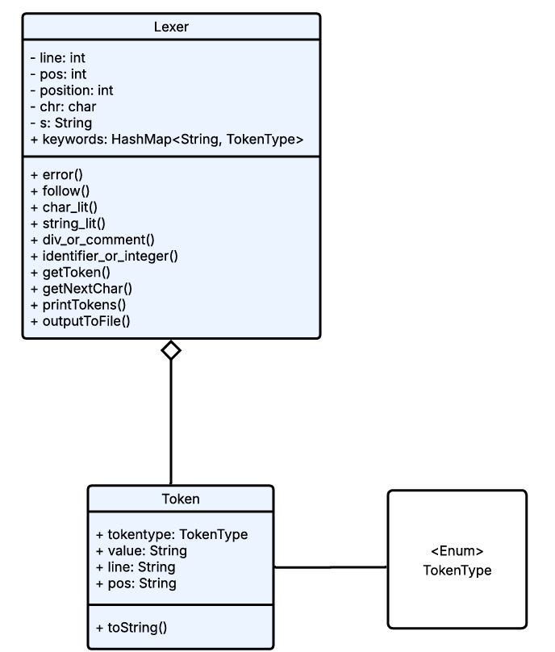
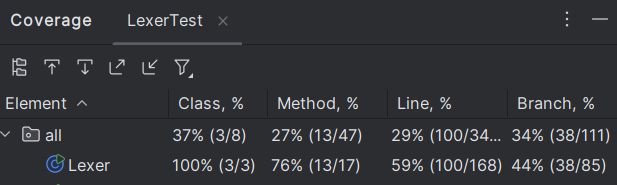

## Description
A project that reads an input file (usually some code written in a subset
of c) and parses it into enumerated tokens. Outputs a .lex file containing
the line, position, type, and value of each token.
## Getting Started
Dependencies
* JDK 23
* IntelliJ IDEA is the recommended IDE
* Any OS that can support JDK 23
* Git

Installing/Executing Program
* Clone repository
* Open project in IntelliJ IDEA
* Set JDK to 23
* Run main() in Lexer.java

## Design

## Unit Testing
